# 可视化小说规划工具


写长篇小说时，最难控制的往往不是“这一章发生了什么”，而是读者的情绪到底被带到了哪里。

章节列表能告诉你顺序，大纲能告诉你事件，人物卡能告诉你角色关系，但它们很难回答一些更麻烦的问题：这一卷是不是铺得太平了？高潮前有没有足够的蓄力？某个转场为什么读起来突然？支线有没有把主线的温度带偏？前面埋下的情绪，后面有没有被接住？

这个项目就是从这些问题开始做的。它先把一部长篇小说看成一条可以被观察的情绪曲线，再把章节节点、逻辑点、区间正文、支线、世界观、角色和提示词模板放到同一个工作台里。你可以沿着主线看节奏，也可以点开某个节点看它承接了什么、要把读者送到哪里。

它不是想替作者写完整本书，而是想把长篇创作里最容易变乱的东西先摆出来：情绪起伏、章节衔接、逻辑桥段、支线位置、正文生成上下文。等这些结构稳住之后，写作和 AI 辅助才不会变成反复救火。

当前版本默认从空白项目开始，不内置示例剧情。截图中的节点是为了展示功能临时生成的演示状态，不会写入默认数据。

## 为什么要做

很多小说工具会从“大纲”和“章节”开始，但真正写到几十章以后，作者遇到的麻烦通常更细。

你可能记得第三十章有一场冲突，也记得第四十章要进入一个高潮，但中间十章读起来为什么泄气，很难从普通列表里看出来。因为列表只记录事件，不记录事件之间的情绪坡度。长篇小说需要的不是单个精彩片段，而是持续的吸引力：什么时候压低，什么时候抬高，什么时候停顿，什么时候释放。

还有一种常见问题是章节衔接。上一章结尾写得很有劲，下一章开头却接不住；某个逻辑点本来很关键，但写正文时被挤到角落；支线原本只是辅助，后来越写越大，反而把主线压住。等这些问题在正文里暴露出来，修改成本已经很高。

所以这个项目把故事线画布放在最前面。先看整本书的走势，再处理每个章节、逻辑点和区间。它更像一个小说结构仪表盘：不只记录“有什么”，还尽量让你看见“它在整条情绪曲线上的位置”。

## 功能地图

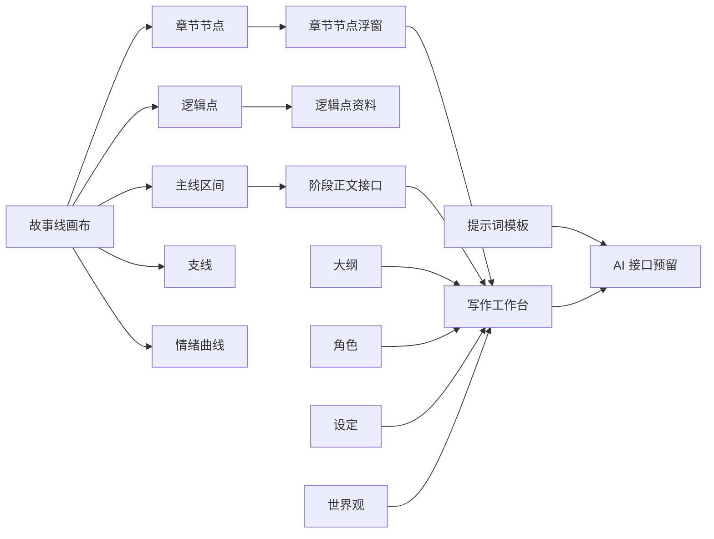

## 故事线：先看情绪，再看事件

故事线是这个项目最重要的页面。它把章节、逻辑点和支线放到同一条阅读路径上，让你先看到整本书的节奏，再进入单个章节处理细节。

### 1. 全书级时间轴

章节节点会自动切分主阅读路径，逻辑点会继续切分所在区间。底部的全书总览可以拖动视口，适合在章节越来越多之后快速定位。它的目的不是做一个漂亮的时间轴，而是让作者在任何时候都能回到“整本书现在长什么样”这个问题上。

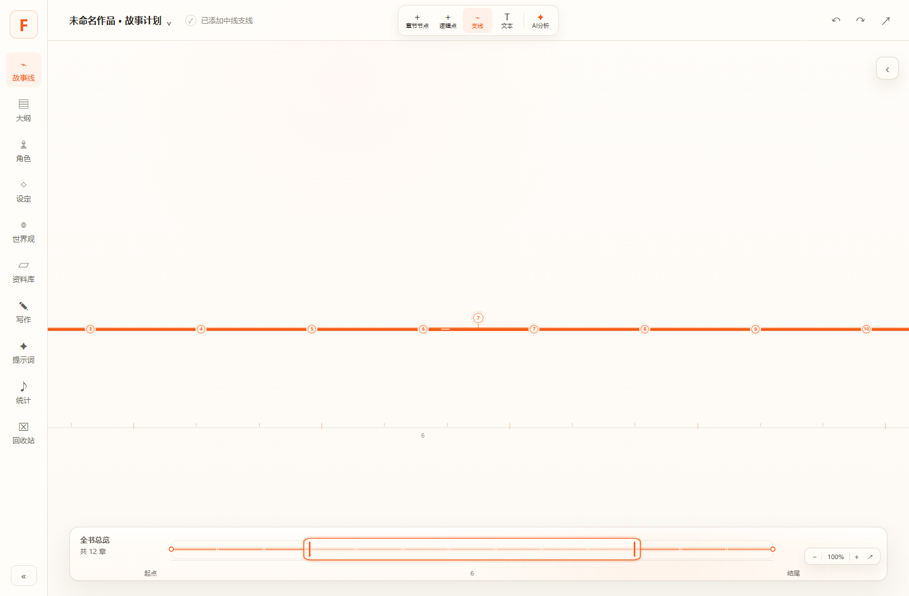

### 2. 节点级资料浮窗

点击章节节点即可打开节点浮窗。这里可以记录上一章结尾点、下一章开头点，也预留了润色、确认和历史切换接口。

这个小浮窗解决的是一个很实际的问题：很多章节不是单独写坏的，而是前后没有接好。上一章留下的是悬念、动作、误会还是情绪余波，下一章开头要接住哪一个，最好在结构阶段就看清楚。

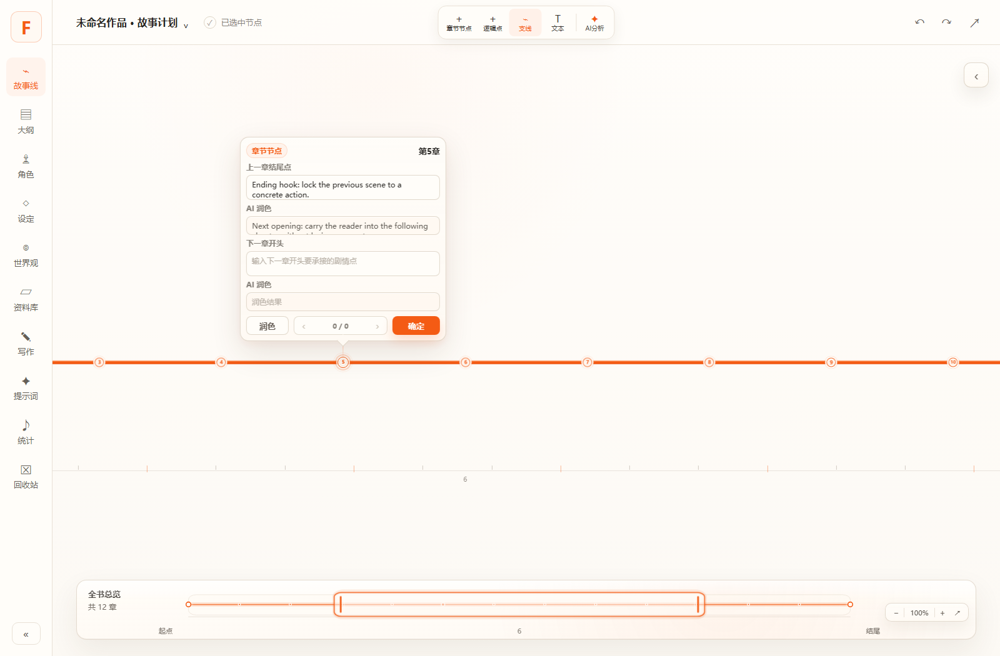

### 3. 区间正文生成入口

两个节点之间的主线区间也可以被选中。区间浮窗里会放阶段正文、生成要求和确认历史。后续接入真实 AI 时，这里会成为正文生成最自然的位置：它知道自己从哪里来，也知道要把剧情推到哪里去。

这比直接对着空白输入框喊“帮我写一段”更可靠。因为区间本身已经带着前后节点、情绪位置和结构任务，生成结果不容易飘到别处。

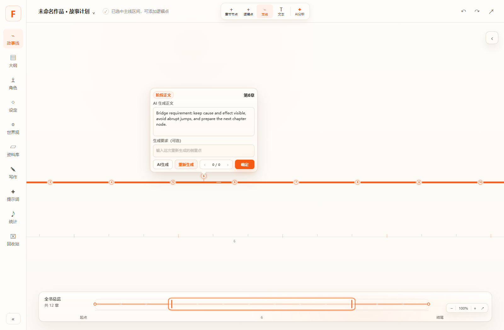

### 4. 情绪曲线与吸附层

情绪层打开后，章节节点可以被拖到不同情绪层级，曲线会随节点变化。它适合观察一卷里哪里太平、哪里过密、哪里需要回落。

这里的曲线不是为了把创作机械化，而是给作者一个反省节奏的视角。有时候你以为写了很多事，但情绪其实一直在同一个水平线上；有时候你以为已经铺垫够了，曲线却显示高潮来得太早。把这些起伏画出来，判断会直观很多。

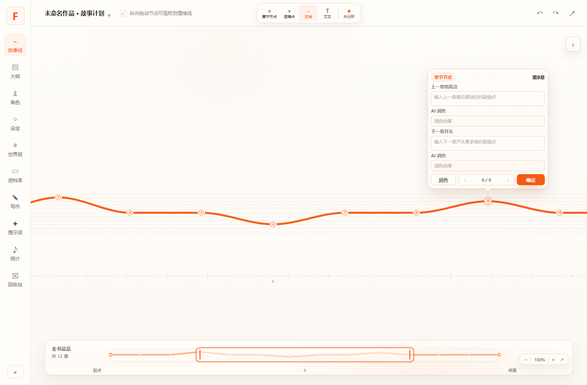

### 5. 右侧信息栏

右侧信息栏默认收起，展开后承接作品总览、主线信息、区间资料和支线资料。它不会挤压画布主体，适合在规划时快速查看上下文。

画布负责看结构，信息栏负责放细节。这样做的好处是，作者不需要在一堆弹窗和页面之间来回跳：选中哪里，旁边就出现和它有关的资料。

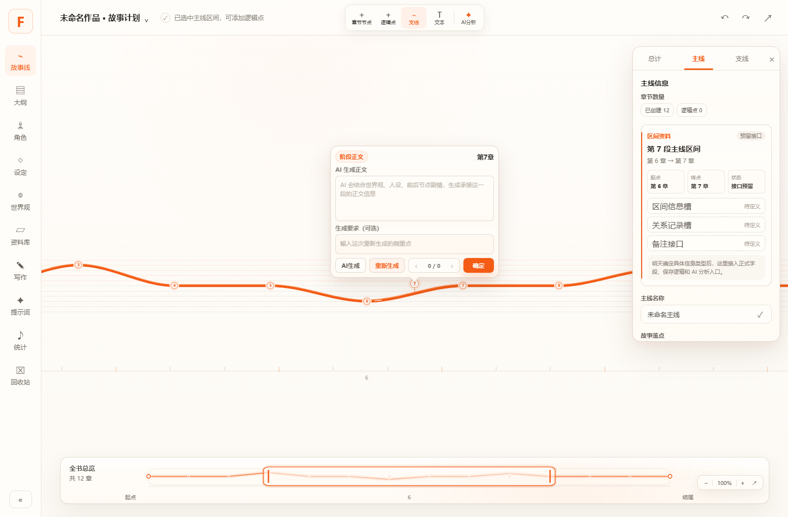

### 6. 支线也在同一条阅读路径里

支线不是另画一条孤立的平行线，而是贴着主阅读路径展示。这样更容易判断它从哪里进入、在哪些章节发力、什么时候该收束。

长篇里支线最容易失控。单独看它时很精彩，放回主线却可能抢走读者注意力。把支线画在同一条阅读路径旁边，能更早看出它有没有越界。

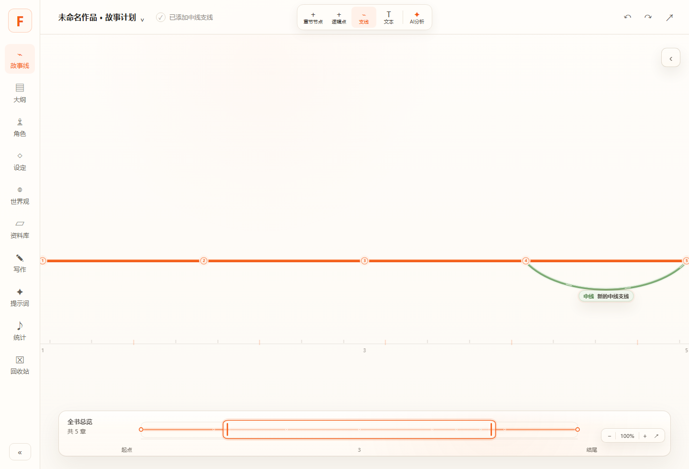

## 其它工作台

### 大纲工作台

大纲从分卷开始组织章节，后续承接章节目的、梗概、冲突、目标字数和正文生成入口。

它的定位不是替代故事线，而是把故事线上的结构意图落成更传统的章节资料。你可以先在画布上判断节奏，再回到大纲里补章节目的、冲突和梗概。

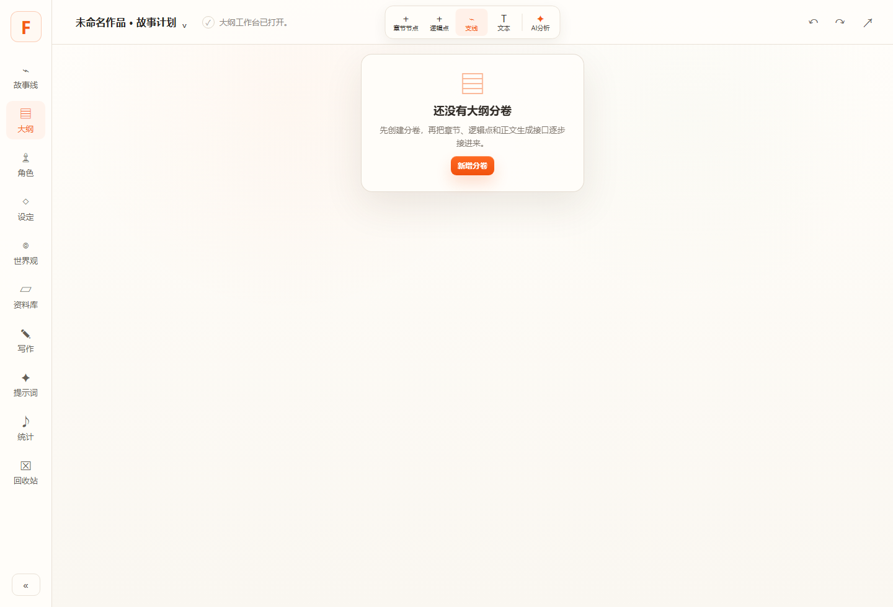

### 写作工作台

写作页会根据故事线或大纲生成章节队列。每章正文按段落编辑，右侧预留润色、按要求改写和整章生成接口。

这个页面关注的是从结构到正文的过渡。章节不是凭空出现的，它应该承接前面的节点、照顾中间的逻辑点，并把读者推向下一个节点。写作页会尽量保留这些结构信息，避免正文阶段重新丢失上下文。

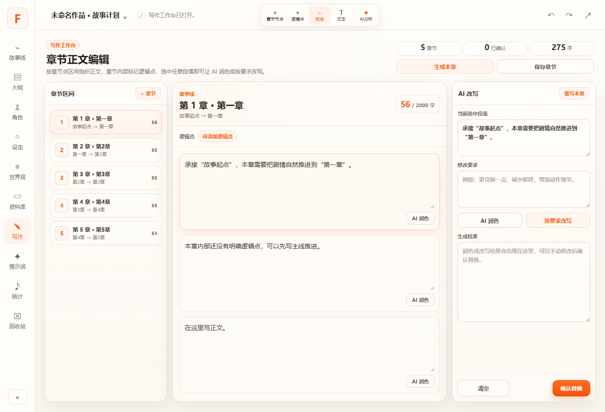

### 提示词工作台

提示词页面集中管理正文生成、节点润色、阶段衔接和结构分析模板。你可以编辑角色定位、变量、生成规则、禁止事项和输出格式，并查看组合后的完整提示词。

后续如果接真实模型，提示词不应该散落在各个按钮里。它应该像项目资料一样被管理、被修改、被复用。这个页面就是为这件事预留的。

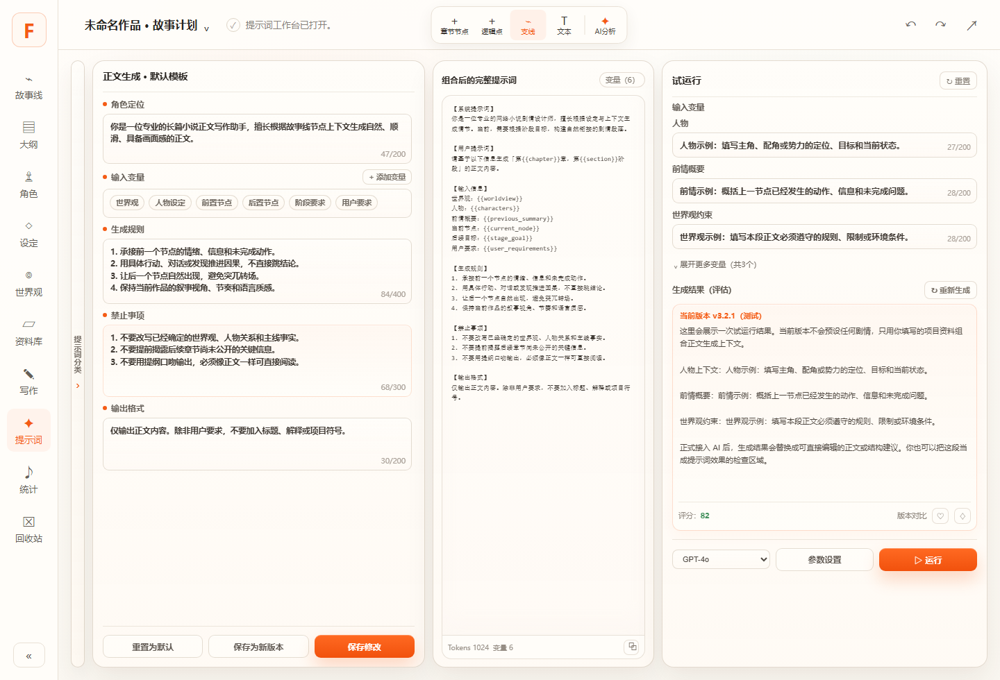

### 世界观工作台

世界观页面为地区、势力、规则和地标预留 3D 星球沙盘视图。它的目标是把世界观从一堆散乱设定变成可以被章节、角色和正文生成共同引用的空间上下文。

世界观不是百科条目堆砌，它会影响角色能不能行动、冲突能不能成立、规则有没有前后矛盾。把这些条目放到可视化页面里，后续做一致性检查和正文生成会更顺。

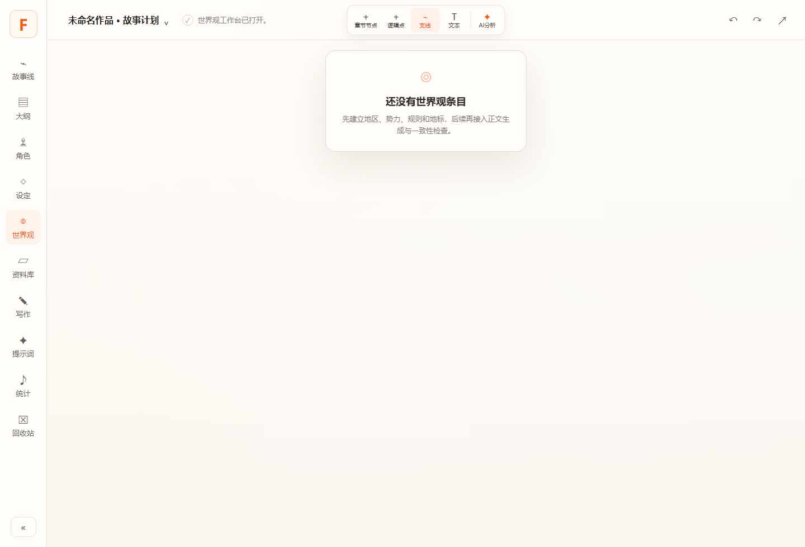

## 已实现能力

- 故事线画布：章节节点、逻辑点、支线、线段选择、缩放、平移、辅助刻度、全书缩略图。
- 节点资料：章节节点、逻辑点、线段区间的小浮窗编辑、AI 占位、确认历史和切换接口。
- 情绪系统：章节节点可在情绪层打开时纵向吸附，逻辑点跟随情绪曲线位置展示。
- 密度策略：低缩放时隐藏细节点，高缩放时逐步显示逻辑点，避免长篇结构挤成一团。
- 大纲：分卷、章节、目标、梗概、冲突、状态和写作排程视图。
- 角色：角色档案、关系和成长弧视图入口。
- 设定：规则、势力、物品、系统等设定资料入口。
- 世界观：基于 Three.js 的世界观星球沙盘组件和条目接口。
- 写作：按章节区间组织正文段落，预留润色、改写和整章生成接口。
- 提示词：集中维护 AI 功能所需提示词模板，避免模板散落在组件中。

## 适合谁

- 正在规划长篇、连载、群像、多卷结构的人。
- 章节、伏笔、支线一多就开始混乱的人。
- 写正文前想先看清情绪曲线和章节承接的人。
- 想把 AI 写作接入自己的结构体系，而不是每次重新复制一堆上下文的人。
- 喜欢把故事拆成节点、区间、关系和状态来管理的人。

## 技术栈

- React 19
- TypeScript
- Vite
- Three.js

## 本地运行

```bash
npm install
npm run dev
```

默认开发地址：

```text
http://127.0.0.1:5173
```

如果端口被占用，Vite 会自动使用后续端口。

## 构建

```bash
npm run build
```

构建产物输出到 `dist/`。

## 项目结构

```text
src/
  App.tsx                      主应用编排和页面切换
  components/                  工作台、画布、面板和浮窗组件
  domain/                      默认数据、时间线计算、写作段落逻辑、提示词模板
  features/                    左侧导航配置
  hooks/useStoryEditor.ts      核心状态、历史记录和编辑操作
  types/story.ts               主要业务类型
  styles.css                   全局布局、视觉和动画样式
docs/
  images/                      README 使用的功能截图
```

## AI 功能状态

当前 AI 相关按钮仍是本地接口占位，不会调用真实模型。现阶段重点是把结构、上下文和提示词管理方式先搭好。

后续接入真实 AI 时，应从提示词工作台读取模板，并把世界观、角色、章节、逻辑点和用户要求组合为统一上下文。这样生成正文时，模型拿到的不是一条孤立命令，而是一段有前因后果的位置说明。

## 开源协议

本项目使用 MIT License，详见 [LICENSE](LICENSE)。
