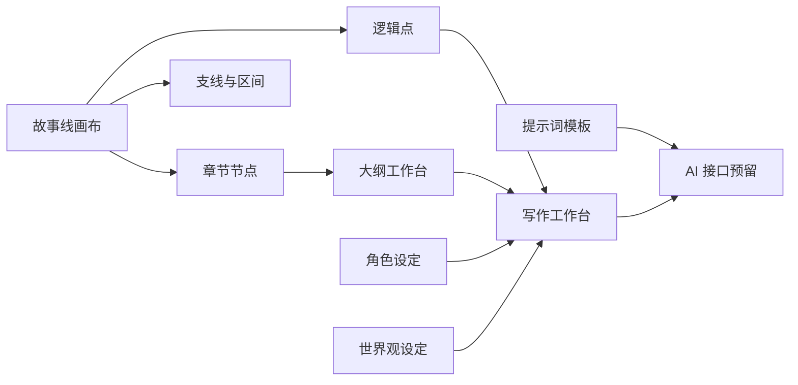

# 可视化小说规划工具

一个面向长篇小说创作的可视化规划工作台。它把故事线、章节大纲、角色、设定、世界观、提示词和正文写作放在同一个应用里，适合用来规划连载结构、拆分章节节点，并为后续 AI 写作接口准备上下文。

当前版本默认从空白项目开始，不内置示例剧情。截图中的节点是为了展示功能临时生成的演示状态，不会写入默认数据。

## 功能总览



## 界面预览

### 故事线画布

故事线画布用横向时间轴管理章节、逻辑点、线段区间和支线。画布支持横向缩放、节点密度控制、底部全书缩略图和分段选择。


### 大纲工作台

大纲从分卷开始组织章节，后续承接章节目的、梗概、冲突、目标字数和正文生成入口。


### 写作工作台

写作页会根据故事线或大纲生成章节队列。每章正文按段落编辑，右侧预留 AI 润色、改写和整章生成接口。


### 提示词工作台

提示词页面集中管理正文生成、节点润色、阶段衔接和结构分析模板，支持编辑规则、查看组合后的完整提示词，并进行本地试运行预览。


### 世界观工作台

世界观页面为地区、势力、规则和地标预留 3D 星球沙盘视图。当前空白状态强调从条目开始建立世界资料，再接入一致性检查和正文生成。


## 已实现能力

- 故事线画布：章节节点、逻辑点、支线、线段选择、缩放、平移、全书缩略图。
- 节点资料：章节节点、逻辑点、线段区间的小浮窗编辑和历史确认接口。
- 大纲：分卷、章节、目标、梗概、冲突和状态视图。
- 角色：角色档案、关系和成长弧视图入口。
- 设定：规则、势力、物品、系统等设定资料入口。
- 世界观：基于 Three.js 的世界观星球沙盘组件和条目接口。
- 写作：按章节区间组织正文段落，预留 AI 润色和改写接口。
- 提示词：集中维护 AI 功能所需提示词模板，避免模板散落在组件中。

## 技术栈

- React 19
- TypeScript
- Vite
- Three.js

## 本地运行

```bash
npm install
npm run dev
```

默认开发地址：

```text
http://127.0.0.1:5173
```

如果端口被占用，Vite 会自动使用后续端口。

## 构建

```bash
npm run build
```

构建产物输出到 `dist/`。

## 项目结构

```text
src/
  App.tsx                      主应用编排和页面切换
  components/                  工作台、画布、面板和浮窗组件
  domain/                      默认数据、时间线计算、写作段落逻辑、提示词模板
  features/                    左侧导航配置
  hooks/useStoryEditor.ts      核心状态、历史记录和编辑操作
  types/story.ts               主要业务类型
  styles.css                   全局布局、视觉和动画样式
docs/
  images/                      README 使用的功能截图
```

## AI 功能状态

当前 AI 相关按钮多为本地接口占位，不会调用真实模型。后续接入真实 AI 时，应从提示词工作台读取模板，并把世界观、角色、章节、逻辑点和用户要求组合为统一上下文。

## 开源协议

本项目使用 MIT License，详见 [LICENSE](LICENSE)。
