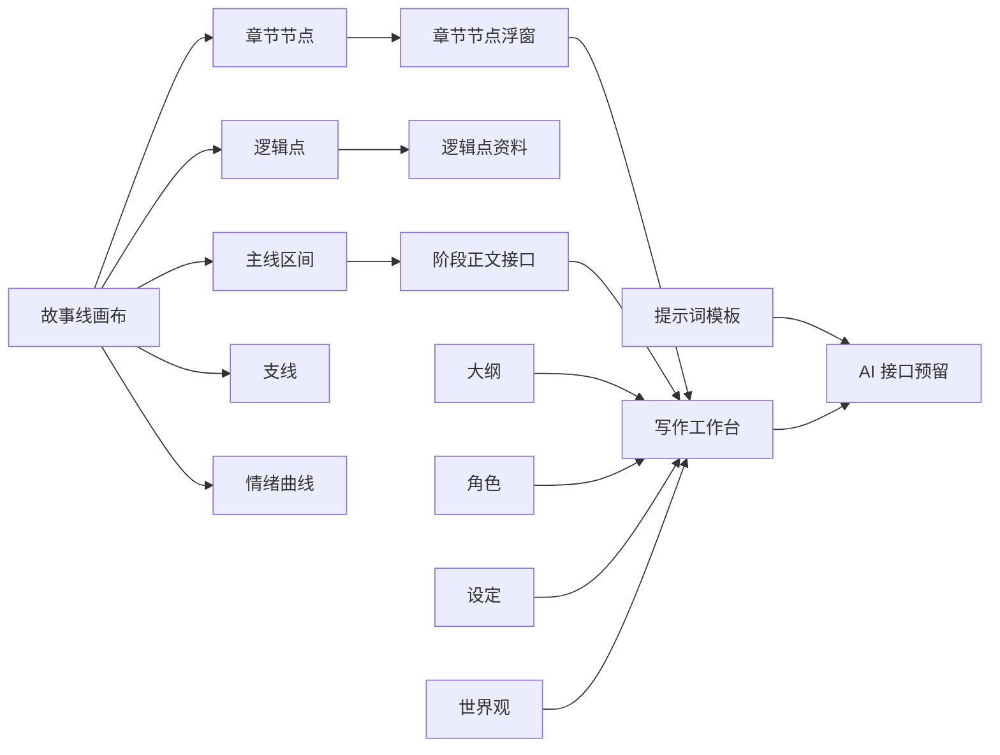

# 可视化 AI 小说写作工具

> Visual AI Novel Writing Tool


## 先说为什么：长篇小说真正难控的是情绪曲线

### 写长篇小说时，最难控制的往往不是“这一章发生了什么”，而是读者的情绪到底被带到了哪里。

章节列表能告诉你顺序。

大纲能告诉你事件。

人物卡能告诉你角色关系。

但它们很难回答这些问题：

| 问题 | 普通大纲为什么不够 |
|---|---|
| 这一卷是不是铺得太平了？ | 事件有了，但情绪起伏看不出来。 |
| 高潮前有没有足够的蓄力？ | 章节列表只能显示顺序，不能显示坡度。 |
| 某个转场为什么读起来突然？ | 前后节点之间缺少清晰的过渡信息。 |
| 支线有没有把主线的温度带偏？ | 支线单独看合理，放回主线可能抢节奏。 |
| 前面埋下的情绪，后面有没有被接住？ | 普通文本很难追踪情绪承接。 |

这个项目就是从这些问题开始做的。

它先把一部长篇小说看成一条可以被观察的情绪曲线，再把章节节点、逻辑点、区间正文、支线、世界观、角色和提示词模板放到同一个工作台里。

你可以沿着主线看节奏，也可以点开某个节点看它承接了什么、要把读者送到哪里。

它不是想替作者写完整本书，而是想把长篇创作里最容易变乱的东西先摆出来：

- 情绪起伏
- 章节衔接
- 逻辑桥段
- 支线位置
- 正文生成上下文

等这些结构稳住之后，写作和 AI 辅助才不会变成反复救火。

当前版本默认从空白项目开始，不内置示例剧情。截图中的节点是为了展示功能临时生成的演示状态，不会写入默认数据。

## 为什么要做

很多小说工具会从“大纲”和“章节”开始。

但真正写到几十章以后，作者遇到的麻烦通常更细。

你可能记得第三十章有一场冲突，也记得第四十章要进入一个高潮，但中间十章读起来为什么泄气，很难从普通列表里看出来。因为列表只记录事件，不记录事件之间的情绪坡度。长篇小说需要的不是单个精彩片段，而是持续的吸引力：什么时候压低，什么时候抬高，什么时候停顿，什么时候释放。

还有一种常见问题是章节衔接。上一章结尾写得很有劲，下一章开头却接不住；某个逻辑点本来很关键，但写正文时被挤到角落；支线原本只是辅助，后来越写越大，反而把主线压住。等这些问题在正文里暴露出来，修改成本已经很高。

所以这个项目把故事线画布放在最前面。

先看整本书的走势，再处理每个章节、逻辑点和区间。

它更像一个小说结构仪表盘：不只记录“有什么”，还尽量让你看见“它在整条情绪曲线上的位置”。

## 功能地图



## 核心工作流：把灵感放到节点上，把正文交给线段去串

### 先分清三个东西

故事线不是单纯画一条时间轴。

它把小说结构拆成三类东西：

| 对象 | 用来做什么 | 你怎么用 |
|---|---|---|
| 章节节点 | 标记一章和下一章之间的接力点。 | 点击节点，在浮窗里写下这一章的结尾、下一章开头，或者灵光一现的剧情点。 |
| 逻辑点 | 记录中间必须发生的小转折、小伏笔、小冲突。 | 插在两个章节节点之间，把“不能漏掉”的剧情钉在主线上。 |
| 节点之间的故事线 | 把两个节点自然串起来。 | 点击线段，在对话框里输入要求，让 AI 根据前后剧情点生成或修改衔接文字。 |

### 推荐使用方式

1. 先添加章节节点，搭出大概的主线骨架。
2. 想到某个剧情点时，直接点击节点，把灵感先写进去。
3. 中间还有必须发生的转折，就插入逻辑点。
4. 两个点都确定后，点击它们之间的故事线，让 AI 生成一段适合的衔接文字。
5. 如果不满意，就继续点这段线，在对话框里写“想怎么改”，再让 AI 按你的方向重写。

> 简单说：节点负责记录灵感，线段负责把灵感串成正文。

### 1. 全书级时间轴

章节节点会自动切分主阅读路径，逻辑点会继续切分所在区间。

底部的全书总览可以拖动视口，适合在章节越来越多之后快速定位。

它的目的不是做一个漂亮的时间轴，而是让作者在任何时候都能回到一个问题上：

> 整本书现在长什么样？


### 2. 章节节点：先把章与章之间的接力点记下来

点击章节节点，就会弹出节点浮窗。

这个浮窗不是让你写完整章节，而是让你先把“这一章承接什么、下一章要从哪里打开”记下来。

你可以在这里先写：

- 上一章最后留下的悬念
- 下一章开头要接住的情绪
- 突然想到的一句对话
- 一个反转动作
- 一个还没想完整但感觉很有用的剧情点

比如你突然想到一个结尾钩子、一句对话、一个反转动作，或者一个还没想完整但感觉很有用的剧情点，都可以先点开章节节点，写进浮窗里。它可以很粗糙，不需要一次成稿。重要的是先把那个灵感固定到正确的位置上。

这个设计解决的是一个很常见的问题：很多章节不是单独写坏的，而是前后没有接好。上一章留下的是悬念、动作、误会还是情绪余波，下一章开头要接住哪一个，最好在结构阶段就看清楚。


### 3. 逻辑点：把突然冒出来的剧情钉在主线上

逻辑点比章节节点更轻。

它不一定是一章，也不一定是一个完整场景，更像是你在写作时突然想到的一个“必须发生”的剧情钉子。

比如：

- 某个角色必须在这里发现线索
- 某个误会必须在这里扩大
- 某个伏笔必须在这里露出一点边
- 某个情绪必须在这里降下去

所以逻辑点可以插在两个章节节点之间。一个区间里逻辑点越多，这段故事线就会被切得越细。这样你不会只看到“第 5 章到第 6 章”，而是能看到中间到底经过了哪些关键转折。

### 4. 节点之间的故事线：让 AI 帮你把两个点串起来

两个节点之间的主线区间也可以被选中。

区间浮窗里会放阶段正文、生成要求和确认历史。

后续接入真实 AI 时，这里会成为正文生成最自然的位置：它知道自己从哪里来，也知道要把剧情推到哪里去。

这也是这个项目最想强调的一点：AI 不应该凭空写一段。它应该知道前一个节点写了什么，后一个节点要抵达哪里，中间有哪些逻辑点不能漏掉，然后再生成一段适合的文字，把两个节点自然串联起来。

如果你觉得这段衔接不满意，也不需要回到一大段正文里慢慢找。

直接点击节点之间那一段故事线，在弹出的对话框里写你的想法：

- 这里不要太快揭露
- 增加一段对话
- 让情绪更压抑一点
- 把冲突提前

然后让 AI 按这个方向重新修改这一段。

也就是说，节点负责记录灵感，线段负责生成衔接；不满意时，也是在这条线段上继续给反馈。这比把所有想法堆进一个大输入框里更清楚。


### 5. 情绪曲线与吸附层

情绪层打开后，章节节点可以被拖到不同情绪层级，曲线会随节点变化。它适合观察一卷里哪里太平、哪里过密、哪里需要回落。

这里的曲线不是为了把创作机械化，而是给作者一个反省节奏的视角。有时候你以为写了很多事，但情绪其实一直在同一个水平线上；有时候你以为已经铺垫够了，曲线却显示高潮来得太早。把这些起伏画出来，判断会直观很多。


### 6. 右侧信息栏

右侧信息栏默认收起，展开后承接作品总览、主线信息、区间资料和支线资料。它不会挤压画布主体，适合在规划时快速查看上下文。

画布负责看结构，信息栏负责放细节。这样做的好处是，作者不需要在一堆弹窗和页面之间来回跳：选中哪里，旁边就出现和它有关的资料。


### 7. 支线也在同一条阅读路径里

支线不是另画一条孤立的平行线，而是贴着主阅读路径展示。这样更容易判断它从哪里进入、在哪些章节发力、什么时候该收束。

长篇里支线最容易失控。单独看它时很精彩，放回主线却可能抢走读者注意力。把支线画在同一条阅读路径旁边，能更早看出它有没有越界。


## 其它工作台

### 大纲工作台

大纲从分卷开始组织章节，后续承接章节目的、梗概、冲突、目标字数和正文生成入口。

它的定位不是替代故事线，而是把故事线上的结构意图落成更传统的章节资料。你可以先在画布上判断节奏，再回到大纲里补章节目的、冲突和梗概。


### 写作工作台

写作页会根据故事线或大纲生成章节队列。每章正文按段落编辑，右侧预留润色、按要求改写和整章生成接口。

这个页面关注的是从结构到正文的过渡。章节不是凭空出现的，它应该承接前面的节点、照顾中间的逻辑点，并把读者推向下一个节点。写作页会尽量保留这些结构信息，避免正文阶段重新丢失上下文。


### 提示词工作台

提示词页面集中管理正文生成、节点润色、阶段衔接和结构分析模板。你可以编辑角色定位、变量、生成规则、禁止事项和输出格式，并查看组合后的完整提示词。

后续如果接真实模型，提示词不应该散落在各个按钮里。它应该像项目资料一样被管理、被修改、被复用。这个页面就是为这件事预留的。


### 世界观工作台

世界观页面为地区、势力、规则和地标预留 3D 星球沙盘视图。它的目标是把世界观从一堆散乱设定变成可以被章节、角色和正文生成共同引用的空间上下文。

世界观不是百科条目堆砌，它会影响角色能不能行动、冲突能不能成立、规则有没有前后矛盾。把这些条目放到可视化页面里，后续做一致性检查和正文生成会更顺。


## 已实现能力

- 故事线画布：章节节点、逻辑点、支线、线段选择、缩放、平移、辅助刻度、全书缩略图。
- 节点资料：章节节点、逻辑点、线段区间的小浮窗编辑、AI 占位、确认历史和切换接口。
- 情绪系统：章节节点可在情绪层打开时纵向吸附，逻辑点跟随情绪曲线位置展示。
- 密度策略：低缩放时隐藏细节点，高缩放时逐步显示逻辑点，避免长篇结构挤成一团。
- 大纲：分卷、章节、目标、梗概、冲突、状态和写作排程视图。
- 角色：角色档案、关系和成长弧视图入口。
- 设定：规则、势力、物品、系统等设定资料入口。
- 世界观：基于 Three.js 的世界观星球沙盘组件和条目接口。
- 写作：按章节区间组织正文段落，预留润色、改写和整章生成接口。
- 提示词：集中维护 AI 功能所需提示词模板，避免模板散落在组件中。

## 适合谁

- 正在规划长篇、连载、群像、多卷结构的人。
- 章节、伏笔、支线一多就开始混乱的人。
- 写正文前想先看清情绪曲线和章节承接的人。
- 想把 AI 写作接入自己的结构体系，而不是每次重新复制一堆上下文的人。
- 喜欢把故事拆成节点、区间、关系和状态来管理的人。

## 技术栈

- React 19
- TypeScript
- Vite
- Three.js

## 本地运行

```bash
npm install
npm run dev
```

默认开发地址：

```text
http://127.0.0.1:5173
```

如果端口被占用，Vite 会自动使用后续端口。

## 构建

```bash
npm run build
```

构建产物输出到 `dist/`。

## 项目结构

```text
src/
  App.tsx                      主应用编排和页面切换
  components/                  工作台、画布、面板和浮窗组件
  domain/                      默认数据、时间线计算、写作段落逻辑、提示词模板
  features/                    左侧导航配置
  hooks/useStoryEditor.ts      核心状态、历史记录和编辑操作
  types/story.ts               主要业务类型
  styles.css                   全局布局、视觉和动画样式
docs/
  images/                      README 使用的功能截图
```

## AI 功能状态

当前 AI 相关按钮仍是本地接口占位，不会调用真实模型。现阶段重点是把结构、上下文和提示词管理方式先搭好。

后续接入真实 AI 时，应从提示词工作台读取模板，并把世界观、角色、章节、逻辑点和用户要求组合为统一上下文。这样生成正文时，模型拿到的不是一条孤立命令，而是一段有前因后果的位置说明。

## 项目状态

这个项目还在持续更新中，个别功能目前只是搭好了入口和界面，还没有完全实现。

不过整体框架已经铺开了：故事线、情绪曲线、节点浮窗、大纲、写作、世界观和提示词管理都已经有了明确的位置。后续可以在这个基础上继续补真实 AI 接口、数据持久化、更多可视化视图和更细的小说工作流。

如果你刚好有灵光一现的想法，欢迎直接拿去完善、改造、优化。这个项目本身也很适合一点点长出来。

## 参与贡献

欢迎从 [ROADMAP.md](ROADMAP.md) 里挑一个方向，也可以先读 [CONTRIBUTING.md](CONTRIBUTING.md) 看看贡献方式。

如果只是突然想到一个功能点，也可以直接开 issue。尤其欢迎和故事线、章节节点、逻辑点、情绪曲线、AI 衔接正文有关的想法。

## 开源协议

本项目使用 MIT License，详见 [LICENSE](LICENSE)。
