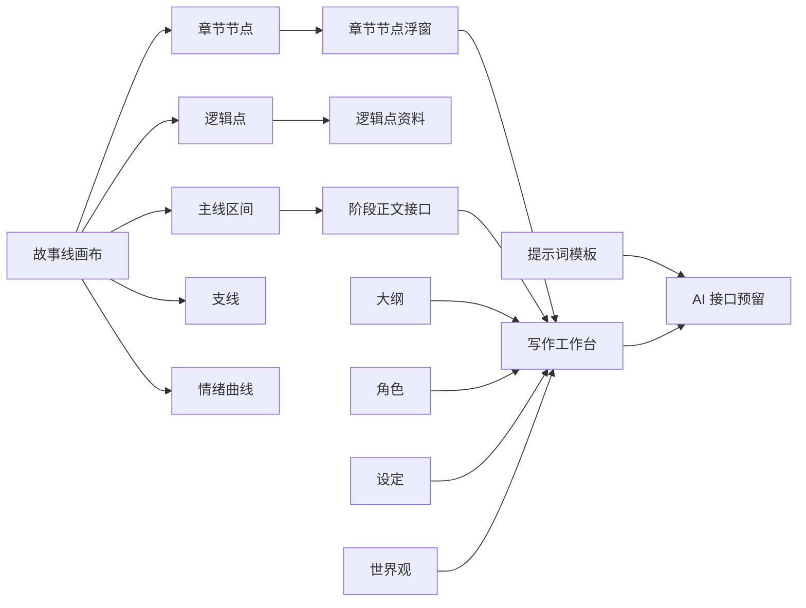

# 可视化小说规划工具


这不是一个普通的大纲编辑器，而是一个为长篇小说准备的“故事工程控制台”。

它把章节节点、逻辑点、支线、区间正文、角色、设定、世界观、提示词模板和写作面板集中在同一个可视化工作区里。目标很直接：让一部长篇小说从“脑子里一团线”变成一张可以缩放、拆分、标注、追踪、生成的结构地图。

当前版本默认从空白项目开始，不内置示例剧情。截图中的节点是为了展示能力临时生成的演示状态，不会写入默认数据。

## 为什么它有点狠

- 它不是只让你写“第几章发生了什么”，而是把章节之间的因果桥、逻辑点和正文接口直接放到主线上。
- 它不是只做一个列表，而是把长篇结构画成一条可以缩放的阅读路径，节点多了也能通过密度策略保持清晰。
- 它不是把 AI 按钮散落在每个角落，而是把提示词模板集中管理，后续接模型时不会变成一堆不可维护的硬编码。
- 它不是营销页式的创作玩具，而是偏工作台的结构工具：紧凑、可扫视、可编辑、可继续扩展。

## 功能地图



## 故事线：核心战场

故事线是这个项目的核心。它把长篇小说从线性文档里拽出来，变成可以直接操作的结构图。

### 1. 全书级时间轴

章节节点会自动切分主阅读路径，逻辑点会继续切分所在区间。底部全书总览可以拖动视口，适合处理中长篇章节越来越多之后的定位问题。


### 2. 节点级资料浮窗

点击章节节点即可打开节点浮窗。这里可以记录上一章结尾点、下一章开头点，并预留 AI 润色、确认和历史切换接口。它的设计目标是让章节之间不再靠“感觉”衔接，而是有明确的可编辑钩子。


### 3. 区间正文生成入口

点击两个节点之间的主线区间，可以打开阶段正文浮窗。这里是后续正文生成的关键入口：前置节点、后置节点、生成要求和确认历史都会在这里汇合。


### 4. 情绪曲线与吸附层

情绪层打开后，章节节点可以被拖到不同情绪层级，曲线会随节点变化。它适合观察一卷里哪里太平、哪里过密、哪里需要起伏。


### 5. 右侧信息栏

右侧信息栏默认收起，展开后承接作品总览、主线信息、区间资料和支线资料。它不会挤压画布主体，适合在规划时快速查看上下文。


### 6. 支线也在同一条阅读路径里

支线不是另画一条孤立的平行线，而是贴着主阅读路径展示，方便判断它从哪里进入、在哪些章节发力、会不会抢主线。


## 其它工作台

### 大纲工作台

大纲从分卷开始组织章节，后续承接章节目的、梗概、冲突、目标字数和正文生成入口。它不是孤立文档，而是故事线和写作页之间的结构中转站。


### 写作工作台

写作页会根据故事线或大纲生成章节队列。每章正文按段落编辑，右侧预留 AI 润色、按要求改写和整章生成接口。它的定位不是替你乱写，而是让“结构上下文 -> 正文段落”这条链路变得可控。


### 提示词工作台

提示词页面集中管理正文生成、节点润色、阶段衔接和结构分析模板。你可以编辑角色定位、变量、生成规则、禁止事项和输出格式，并查看组合后的完整提示词。


### 世界观工作台

世界观页面为地区、势力、规则和地标预留 3D 星球沙盘视图。它的目标是把世界观从一堆散乱设定变成可以被章节、角色和正文生成共同引用的空间上下文。


## 已实现能力

- 故事线画布：章节节点、逻辑点、支线、线段选择、缩放、平移、辅助刻度、全书缩略图。
- 节点资料：章节节点、逻辑点、线段区间的小浮窗编辑、AI 占位、确认历史和切换接口。
- 情绪系统：章节节点可在情绪层打开时纵向吸附，逻辑点跟随情绪曲线位置展示。
- 密度策略：低缩放时隐藏细节点，高缩放时逐步显示逻辑点，避免长篇结构变成一团糊。
- 大纲：分卷、章节、目标、梗概、冲突、状态和写作排程视图。
- 角色：角色档案、关系和成长弧视图入口。
- 设定：规则、势力、物品、系统等设定资料入口。
- 世界观：基于 Three.js 的世界观星球沙盘组件和条目接口。
- 写作：按章节区间组织正文段落，预留 AI 润色、改写和整章生成接口。
- 提示词：集中维护 AI 功能所需提示词模板，避免模板散落在组件中。

## 适合谁

- 正在规划长篇、连载、群像、多卷结构的人。
- 章节、伏笔、支线一多就开始混乱的人。
- 想把 AI 写作接入自己的结构体系，而不是每次重新复制一堆上下文的人。
- 喜欢把故事拆成节点、区间、关系和状态来管理的人。

## 技术栈

- React 19
- TypeScript
- Vite
- Three.js

## 本地运行

```bash
npm install
npm run dev
```

默认开发地址：

```text
http://127.0.0.1:5173
```

如果端口被占用，Vite 会自动使用后续端口。

## 构建

```bash
npm run build
```

构建产物输出到 `dist/`。

## 项目结构

```text
src/
  App.tsx                      主应用编排和页面切换
  components/                  工作台、画布、面板和浮窗组件
  domain/                      默认数据、时间线计算、写作段落逻辑、提示词模板
  features/                    左侧导航配置
  hooks/useStoryEditor.ts      核心状态、历史记录和编辑操作
  types/story.ts               主要业务类型
  styles.css                   全局布局、视觉和动画样式
docs/
  images/                      README 使用的功能截图
```

## AI 功能状态

当前 AI 相关按钮仍是本地接口占位，不会调用真实模型。后续接入真实 AI 时，应从提示词工作台读取模板，并把世界观、角色、章节、逻辑点和用户要求组合为统一上下文。

换句话说：现在它已经把“AI 应该吃什么上下文”这条路铺好了，真实模型接入是下一阶段。

## 开源协议

本项目使用 MIT License，详见 [LICENSE](LICENSE)。
